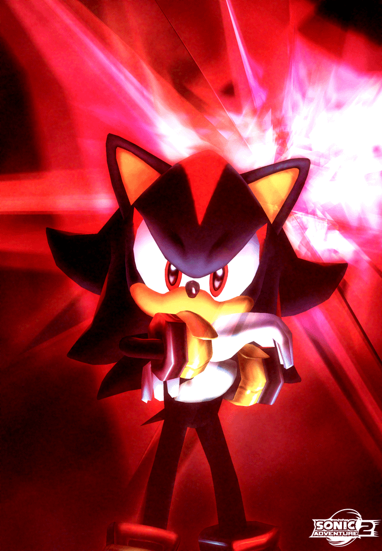
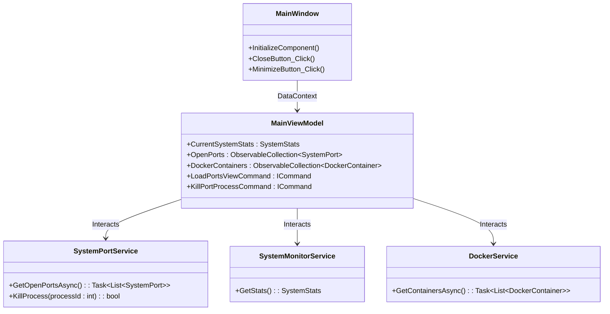

# DEV MGR [Y2K] - Task Manager

A hyper-stylized System & Developer Manager built with **C# WPF** designed around an unmistakable **Y2K / Winamp / Sci-Fi** aesthetic. 

Allows for deep Operating System querying with a sleek glass interface:
*   🔥 Track live CPU and RAM Hardware Stats.
*   💀 Scan for active Open Ports and immediately KILL the locking processes.
*   🐳 View Docker Containers and active port bindings natively.

---

## 🏗️ Architecture (UML)

The app follows a Clean Architecture approach within the MVVM pattern constraints. Views only hold styling and routing logic, ViewModels manage the state, and Services execute the heavy OS lifting.

---

## 🚀 Future Implementations

*   **Network Packet Sniffing**: Extend the `Ports` module to allow for primitive deep-packet visual tracing via raw sockets for developers.
*   **Docker Container Controls**: Currently we just view containers. We need fully-functional UI buttons to **Start, Stop, Restart, and Build** Docker containers directly from the app.
*   **Audio Visualizer (Winamp Style)**: A real-time wave audio renderer at the bottom of the screen pulling from `WASAPI` loopback audio to perfect the 2000s Sci-Fi vibe.

---

## 📝 TODO List

- [ ] Refactor generic Regex parsing in `SystemPortService` for non-Windows parity (if Porting to MAUI/Avalonia).
- [ ] Add loading animations / skeleton screens while `DockerService` queries the CLI.
- [ ] Implement settings page to let the user change the Y2K color palette (e.g. from Dark Chrome to Neon Matrix Green).
- [ ] Create an installation script (`.ps1`) to automatically configure Docker CLI permissions for Windows.
- [ ] Add System Tray integration so it can run minimized without taking up taskbar space.

---

> _made by biagigio_
